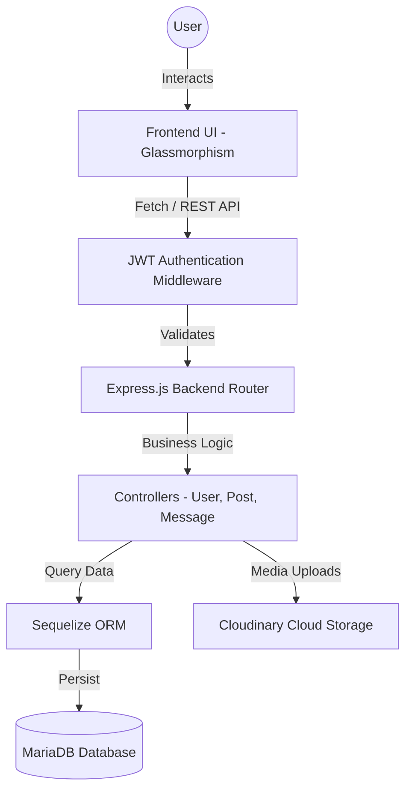

# 📱 Loopline: Production-Quality Mini Social Media Platform

🌐 **Live Demo:** [https://code-alpha-social-media-phi.vercel.app/](https://code-alpha-social-media-phi.vercel.app/)

Loopline is a fully functional, end-to-end full-stack social media application. It provides a premium, dark-mode design system with secure authentication, real-time interactions, and comprehensive profile management.

## 🚀 Key Features & Innovations
* **💬 Real-time Messaging:** Instantly chat with your friends. Recent chats automatically move to the top for seamless communication.
* **🎬 Reels & Short Videos:** Swipe vertically through short videos in the immersive Reels section, fully optimized for mobile devices.
* **📸 Stories:** Share 24-hour disappearing photo and text stories, displayed beautifully at the top of the feed.
* **🌐 Dynamic Social Graph:** Fully functional posts, comments, likes, and followers system. Create your community.
* **⚙️ Profile & Settings Management:** Edit your profile, upload avatars/cover photos, and configure application settings easily.
* **🔐 Secure Authentication:** Secure JWT authentication with HttpOnly refresh tokens and an OTP-based forgot password flow.

## 🛡️ Security & Technical Excellence
* **Robust Backend Architecture:** Built on Node.js and Express with Sequelize ORM for MariaDB, providing a scalable and structured backend.
* **Enterprise-Grade Security:** Comprehensive input validation, bcrypt password hashing, parameterized queries to prevent SQL injection, and rate limiting against brute force attacks.
* **Seamless Developer Experience:** Integrated Nodemon for hot-reloading backend changes instantly without manual restarts.
* **Responsive App-like UI:** A fully responsive UI optimized for both desktop and mobile devices featuring smooth micro-interactions, dark mode, and glassmorphism.

## 🏗️ Technical Architecture


## 💻 Technology Stack
* **Frontend:** HTML5, Vanilla JavaScript (ES6+), Custom CSS Variables (Glassmorphism UI)
* **Backend:** Node.js, Express.js
* **Database:** MariaDB, Sequelize (ORM)
* **Authentication:** JSON Web Tokens (JWT), bcrypt.js
* **File Storage:** Cloudinary, Multer
* **Dev Tools:** Nodemon, dotenv

## 🛠️ Setup & Installation

### Prerequisites
* **Node.js** (v14 or higher)
* **MariaDB** (Running locally on default port 3306)

### 1. Clone and Install
```bash
git clone <repo-url>
cd "Social Media Platform"
npm install
```

### 2. Database Setup
Open your MariaDB client (e.g., HeidiSQL) and run:
```sql
CREATE DATABASE IF NOT EXISTS minisocial;
CREATE USER IF NOT EXISTS 'nodeuser'@'localhost' IDENTIFIED BY 'password123';
GRANT ALL PRIVILEGES ON minisocial.* TO 'nodeuser'@'localhost';
FLUSH PRIVILEGES;
```

### 3. Environment Variables
Copy the example environment file:
```bash
cp .env.example .env
```
Ensure `DB_USER=nodeuser` and `DB_PASS=password123` are set.
*Note: Nodemailer is preconfigured to use Ethereal Email for testing the forgot password flow.*

### 4. Seed the Database
Populate the database with sample users and content:
```bash
node backend/seed.js
```

### 5. Start the Server
Start the development server (auto-reloads on file changes):
```bash
npm run dev
```

### 6. Open the Frontend
Open your browser and navigate to:
👉 **http://localhost:3000**
